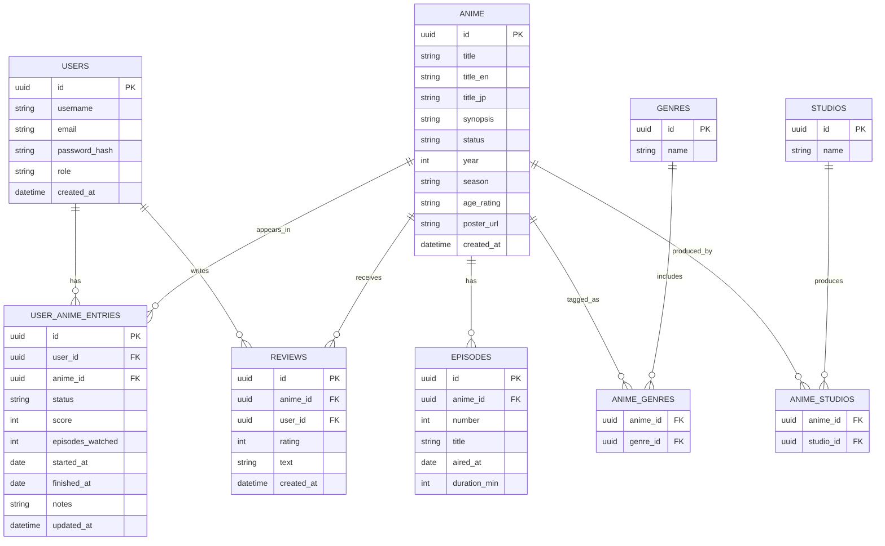

# ER Diagram

```mermaid

erDiagram

USERS ||--o{ USER_ANIME_ENTRIES : has
ANIME ||--o{ USER_ANIME_ENTRIES : appears_in

USERS ||--o{ REVIEWS : writes
ANIME ||--o{ REVIEWS : receives

ANIME ||--o{ EPISODES : has

ANIME ||--o{ ANIME_GENRES : tagged_as
GENRES ||--o{ ANIME_GENRES : includes

ANIME ||--o{ ANIME_STUDIOS : produced_by
STUDIOS ||--o{ ANIME_STUDIOS : produces

USERS {
uuid id PK
string username
string email
string password_hash
string role
datetime created_at
}

ANIME {
uuid id PK
string title
string title_en
string title_jp
string synopsis
string status
int year
string season
string age_rating
string poster_url
datetime created_at
}

EPISODES {
uuid id PK
uuid anime_id FK
int number
string title
date aired_at
int duration_min
}

REVIEWS {
uuid id PK
uuid anime_id FK
uuid user_id FK
int rating
string text
datetime created_at
}

USER_ANIME_ENTRIES {
uuid id PK
uuid user_id FK
uuid anime_id FK
string status
int score
int episodes_watched
date started_at
date finished_at
string notes
datetime updated_at
}

GENRES {
uuid id PK
string name
}

ANIME_GENRES {
uuid anime_id FK
uuid genre_id FK
}

STUDIOS {
uuid id PK
string name
}

ANIME_STUDIOS {
uuid anime_id FK
uuid studio_id FK
}


```